# System Architecture Documentation
## Queue Factor Visualizer

---

## 🏗️ OVERVIEW

This document provides a comprehensive overview of the Queue Factor Visualizer system architecture, including technical implementation details, component relationships, and system design principles.

---

## 🎯 SYSTEM ARCHITECTURE

### High-Level Architecture

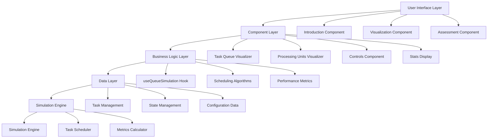

### Component Hierarchy

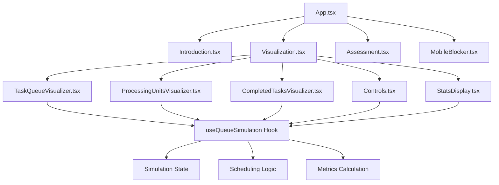

---

## 🔧 TECHNICAL IMPLEMENTATION

### Technology Stack

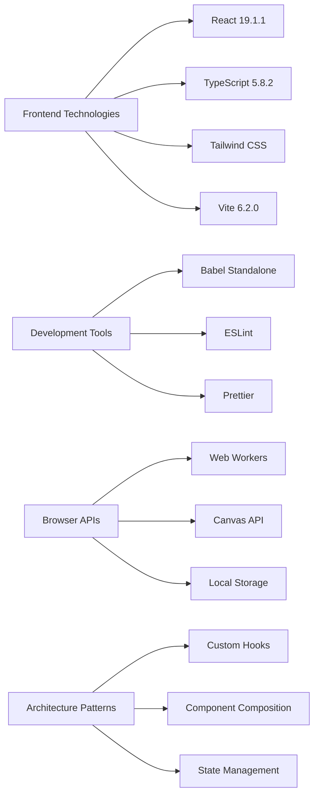

### Data Flow Architecture

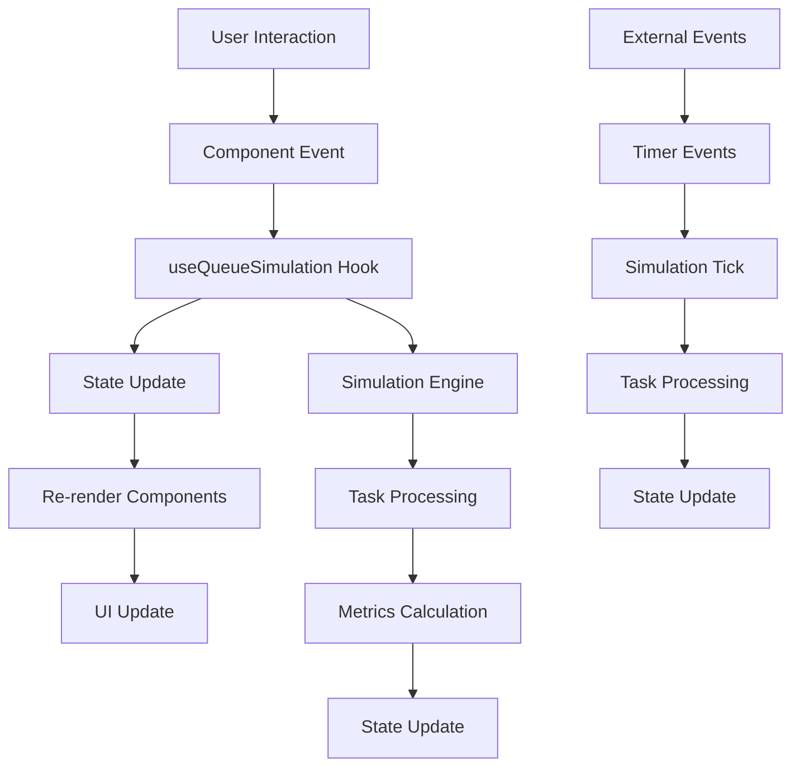

---

## 🎮 USER INTERFACE ARCHITECTURE

### Page Structure

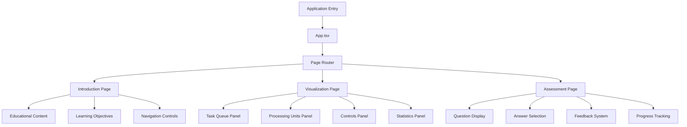

### Component Communication

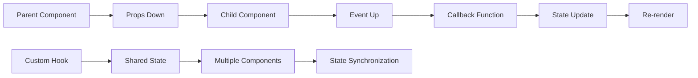

---

## 🧠 SIMULATION ENGINE ARCHITECTURE

### Core Simulation Logic

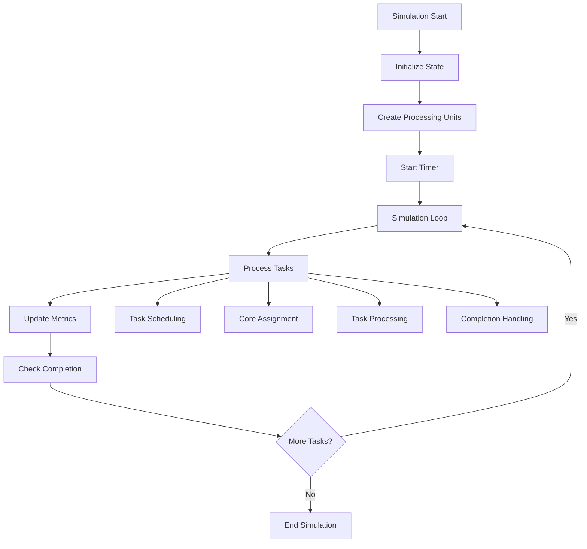

### Task Lifecycle

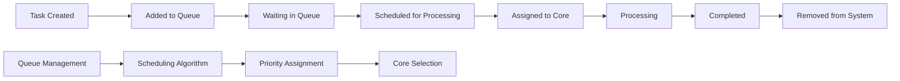

### Scheduling Algorithms

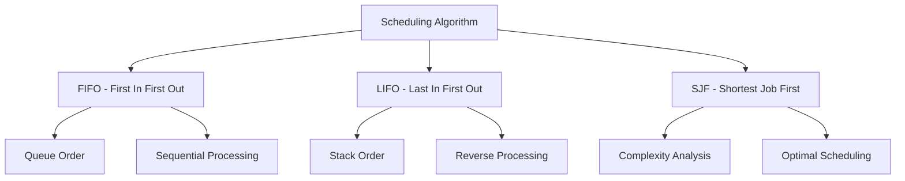

---

## 📊 DATA ARCHITECTURE

### State Management

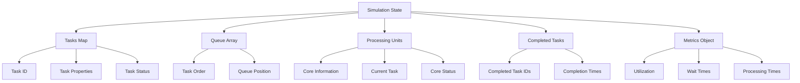

### Data Types

```mermaid
graph LR
    A[Core Types] --> B[Task Interface]
    A --> C[ProcessingUnit Interface]
    A --> D[SimulationState Interface]
    A --> E[Metrics Interface]
    
    B --> B1[id: string]
    B --> B2[complexity: TaskComplexity]
    B --> B3[status: TaskStatus]
    B --> B4[processingTime: number]
    
    C --> C1[id: string]
    C --> C2[type: ProcessingUnitType]
    C --> C3[currentTask: Task | null]
    
    D --> D1[tasks: Map<string, Task>]
    D --> D2[queue: string[]]
    D --> D3[processingUnits: ProcessingUnit[]]
```

---

## 🔄 PERFORMANCE ARCHITECTURE

### Optimization Strategies

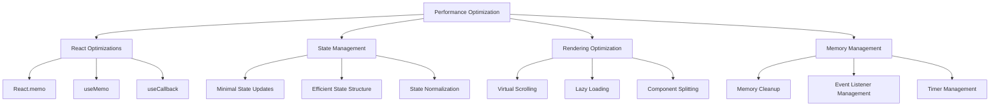

### Rendering Pipeline

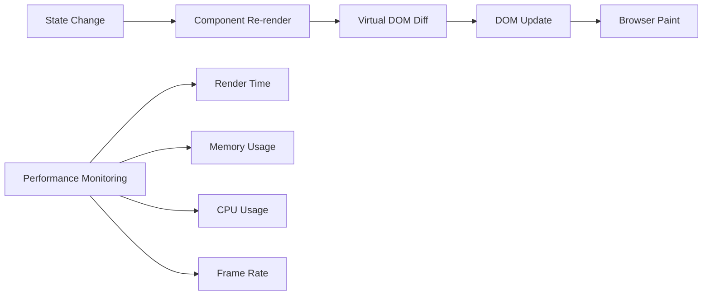

---

## 🎓 EDUCATIONAL ARCHITECTURE

### Learning Progression

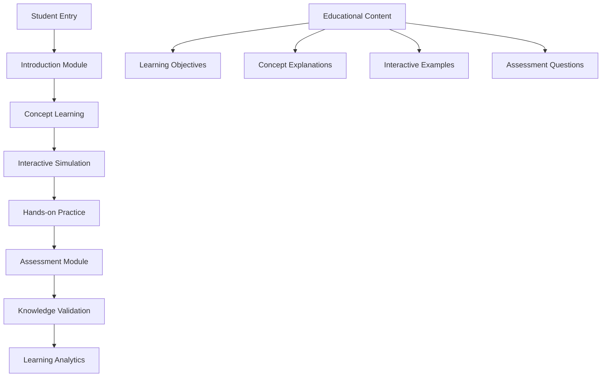

### Assessment System

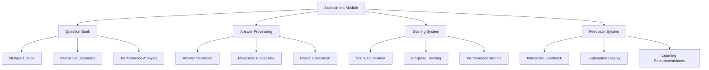

---

## 🔒 SECURITY ARCHITECTURE

### Access Control

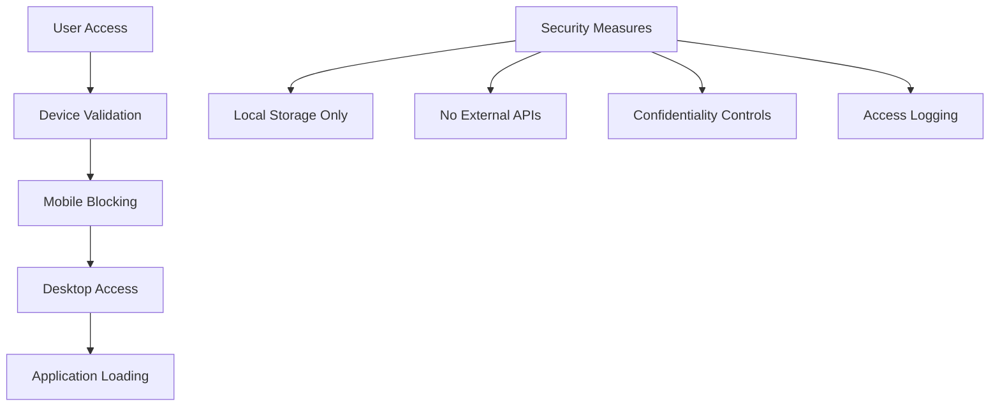

### Data Protection

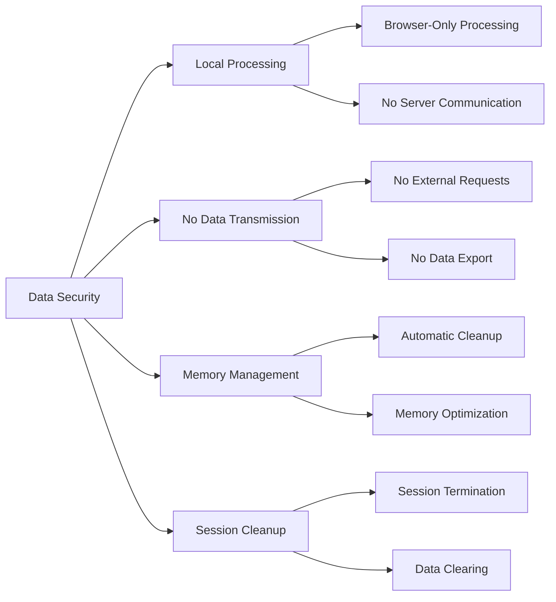

---

## 🚀 DEPLOYMENT ARCHITECTURE

### Deployment Strategy

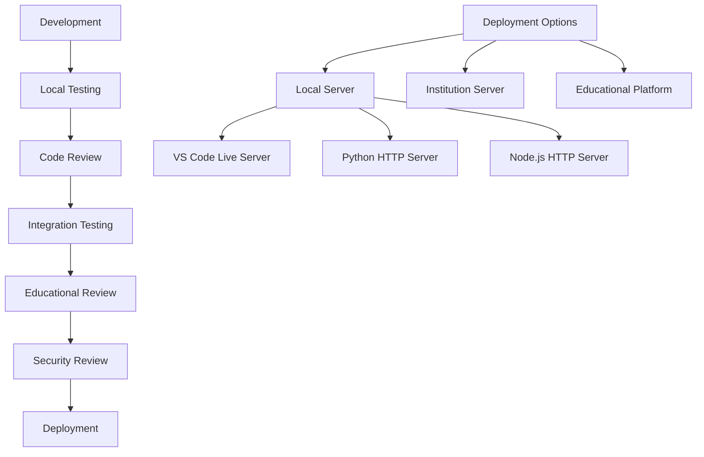

### Environment Configuration

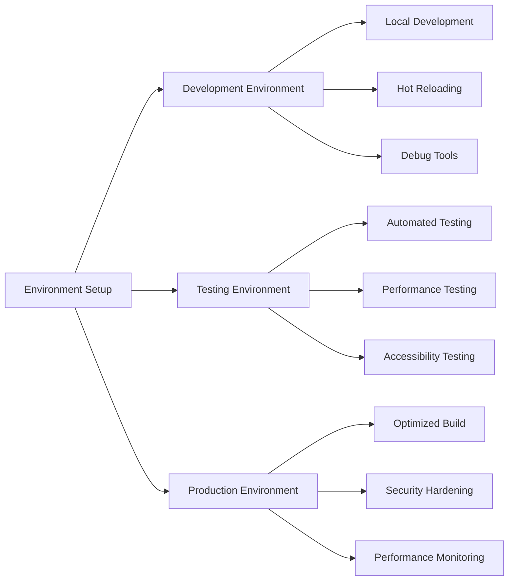

---

## 📈 MONITORING AND ANALYTICS

### Performance Monitoring

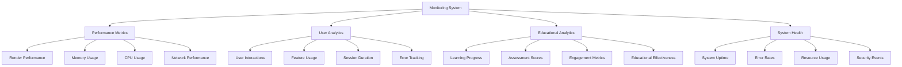

---

## 🔮 FUTURE ARCHITECTURE

### Planned Enhancements

```mermaid
graph TD
    A[Future Architecture] --> B[Advanced Features]
    A --> C[Scalability Improvements]
    A --> D[Educational Enhancements]
    A --> E[Technical Upgrades]
    
    B --> B1[Multi-User Support]
    B --> B2[Real-time Collaboration]
    B --> B3[Advanced Algorithms]
    B --> B4[AI Integration]
    
    C --> C1[Microservices Architecture]
    C --> C2[Cloud Deployment]
    C --> C3[Load Balancing]
    C --> C4[Auto-scaling]
    
    D --> D1[Personalized Learning]
    D --> D2[Adaptive Assessment]
    D --> D3[Learning Analytics]
    D --> D4[Progress Tracking]
    
    E --> E1[Modern Framework]
    E --> E2[Performance Optimization]
    E --> E3[Security Hardening]
    E --> E4[Accessibility Improvements]
```

---

## 📚 DOCUMENTATION ARCHITECTURE

### Documentation Structure

```mermaid
graph TD
    A[Documentation] --> B[Technical Documentation]
    A --> C[Educational Documentation]
    A --> D[User Documentation]
    A --> E[Developer Documentation]
    
    B --> B1[Architecture Docs]
    B --> B2[API Documentation]
    B --> B3[Code Documentation]
    B --> B4[Deployment Guides]
    
    C --> C1[Learning Objectives]
    C --> C2[Curriculum Integration]
    C --> C3[Assessment Guides]
    C --> C4[Teaching Materials]
    
    D --> D1[User Guides]
    D --> D2[Getting Started]
    D --> D3[Feature Documentation]
    D --> D4[Troubleshooting]
    
    E --> E1[Development Setup]
    E --> E2[Contribution Guidelines]
    E --> E3[Code Standards]
    E --> E4[Testing Guidelines]
```

---

## 🎯 CONCLUSION

The Queue Factor Visualizer architecture is designed to provide a robust, scalable, and educational platform for visualizing neural network task scheduling. The modular design ensures maintainability, while the educational focus ensures effective learning outcomes.

The architecture supports:
- **Educational Excellence**: Optimized for learning outcomes
- **Technical Robustness**: Scalable and maintainable codebase
- **Security**: Confidential and secure educational environment
- **Performance**: Optimized for smooth educational experience
- **Accessibility**: Inclusive design for all students

---

*© 2024 College Research Project. All rights reserved. Confidential and proprietary.*

**Version**: 1.0  
**Effective Date**: [Current Date]  
**Last Updated**: [Current Date]
