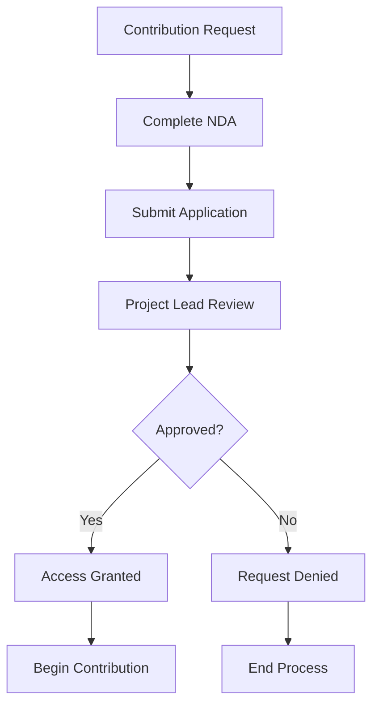
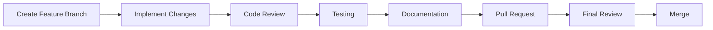
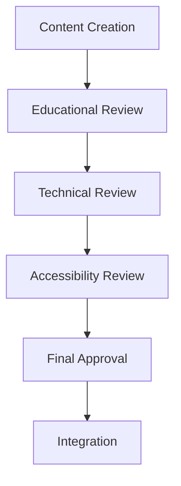
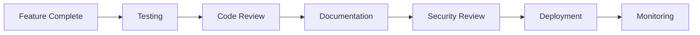

# Contributing Guidelines
## Queue Factor Visualizer Research Project

---

## 🎯 CONTRIBUTION OVERVIEW

Thank you for your interest in contributing to the Queue Factor Visualizer research project. This document outlines the guidelines, processes, and requirements for contributing to this educational research project.

---

## ⚠️ IMPORTANT NOTICE

**This is a confidential college research project with strict access controls and usage restrictions. All contributions are subject to the Non-Disclosure Agreement (NDA) and License Agreement.**

---

## 🔒 ACCESS REQUIREMENTS

### Prerequisites for Contribution

1. **Authorized Access**: Only pre-approved individuals may contribute
2. **NDA Signed**: Non-Disclosure Agreement must be completed
3. **Educational Affiliation**: Must be associated with the educational institution
4. **Project Approval**: Contribution must be approved by project lead
5. **Confidentiality Training**: Must complete confidentiality training

### Who Can Contribute

- **Project Team Members**: Core development team
- **Faculty Advisors**: Academic supervisors and advisors
- **Authorized Students**: Students in the research program
- **Institution Staff**: Approved institutional personnel
- **External Collaborators**: Pre-approved external contributors

---

## 📋 CONTRIBUTION PROCESS

### Step 1: Request Access



### Step 2: Contribution Workflow



---

## 🛠️ DEVELOPMENT GUIDELINES

### Code Standards

#### TypeScript/JavaScript
- **Type Safety**: All code must be fully typed
- **ESLint Compliance**: Must pass all linting rules
- **Prettier Formatting**: Consistent code formatting
- **Documentation**: Comprehensive inline documentation
- **Error Handling**: Robust error handling and validation

#### React Components
- **Functional Components**: Use functional components with hooks
- **Performance**: Optimize for performance with React.memo
- **Accessibility**: WCAG 2.1 AA compliance
- **Responsive Design**: Mobile-first responsive design
- **Component Composition**: Favor composition over inheritance

#### Testing Requirements
- **Unit Tests**: Comprehensive unit test coverage
- **Integration Tests**: Test component interactions
- **Accessibility Tests**: Ensure accessibility compliance
- **Performance Tests**: Validate performance requirements
- **Educational Tests**: Test educational functionality

### File Organization

```
components/
├── [ComponentName].tsx          # Main component file
├── [ComponentName].test.tsx     # Unit tests
├── [ComponentName].stories.tsx  # Storybook stories (if applicable)
└── [ComponentName].types.ts    # Component-specific types
```

### Naming Conventions

- **Files**: PascalCase for components, camelCase for utilities
- **Components**: PascalCase (e.g., `TaskQueueVisualizer`)
- **Functions**: camelCase (e.g., `calculateMetrics`)
- **Constants**: UPPER_SNAKE_CASE (e.g., `MAX_TASK_COUNT`)
- **Types**: PascalCase with descriptive names (e.g., `TaskStatus`)

---

## 📚 DOCUMENTATION REQUIREMENTS

### Code Documentation

```typescript
/**
 * Calculates the utilization percentage of processing units
 * @param processingUnits - Array of processing units to analyze
 * @param totalTime - Total simulation time in ticks
 * @returns Utilization percentage (0-100)
 * @example
 * const utilization = calculateUtilization(units, 1000);
 */
export const calculateUtilization = (
  processingUnits: ProcessingUnit[],
  totalTime: number
): number => {
  // Implementation
};
```

### Component Documentation

```typescript
/**
 * TaskQueueVisualizer Component
 * 
 * Displays the current state of the task queue with real-time updates.
 * Shows task status, scheduling algorithm, and queue statistics.
 * 
 * @param tasks - Array of tasks in the queue
 * @param algorithm - Current scheduling algorithm
 * @param onTaskClick - Callback when a task is clicked
 * @param isRunning - Whether simulation is currently running
 */
interface TaskQueueVisualizerProps {
  tasks: Task[];
  algorithm: SchedulingAlgorithm;
  onTaskClick: (task: Task) => void;
  isRunning: boolean;
}
```

### README Updates

All contributions must include:
- **Feature Description**: Clear description of new functionality
- **Usage Examples**: How to use new features
- **Screenshots**: Visual documentation of changes
- **Testing Instructions**: How to test the changes
- **Breaking Changes**: Any breaking changes and migration guide

---

## 🧪 TESTING REQUIREMENTS

### Test Coverage

- **Minimum Coverage**: 80% code coverage required
- **Critical Paths**: 100% coverage for core simulation logic
- **Edge Cases**: Test all edge cases and error conditions
- **Performance**: Validate performance requirements
- **Accessibility**: Test accessibility compliance

### Test Types

#### Unit Tests
```typescript
describe('calculateUtilization', () => {
  it('should calculate correct utilization for active units', () => {
    const units = [
      { id: '1', type: 'cpu', currentTask: mockTask },
      { id: '2', type: 'cpu', currentTask: null }
    ];
    const result = calculateUtilization(units, 100);
    expect(result).toBe(50);
  });
});
```

#### Integration Tests
```typescript
describe('TaskQueueVisualizer Integration', () => {
  it('should update queue display when tasks are added', () => {
    // Test component integration
  });
});
```

#### Accessibility Tests
```typescript
describe('Accessibility', () => {
  it('should be keyboard navigable', () => {
    // Test keyboard navigation
  });
  
  it('should have proper ARIA labels', () => {
    // Test ARIA compliance
  });
});
```

---

## 🎓 EDUCATIONAL CONTRIBUTIONS

### Educational Content Guidelines

- **Learning Objectives**: Clear, measurable learning objectives
- **Progressive Difficulty**: Content should progress from basic to advanced
- **Interactive Elements**: Engaging, interactive educational content
- **Assessment Integration**: Proper integration with assessment system
- **Accessibility**: Content must be accessible to all students

### Content Types

1. **Tutorial Content**: Step-by-step learning guides
2. **Interactive Examples**: Hands-on learning experiences
3. **Assessment Questions**: Educational assessment content
4. **Visual Aids**: Diagrams, charts, and visual explanations
5. **Code Examples**: Well-documented code examples

### Content Review Process



---

## 🔍 CODE REVIEW PROCESS

### Review Checklist

#### Functionality
- [ ] Code works as intended
- [ ] No breaking changes
- [ ] Performance requirements met
- [ ] Error handling implemented
- [ ] Edge cases covered

#### Code Quality
- [ ] Code is readable and maintainable
- [ ] Follows established patterns
- [ ] No code duplication
- [ ] Proper error handling
- [ ] Performance optimized

#### Documentation
- [ ] Code is well documented
- [ ] README updated
- [ ] Type definitions complete
- [ ] Examples provided
- [ ] Breaking changes documented

#### Testing
- [ ] Unit tests written
- [ ] Integration tests added
- [ ] Accessibility tests included
- [ ] Performance tests validated
- [ ] All tests passing

#### Security
- [ ] No security vulnerabilities
- [ ] Input validation implemented
- [ ] No sensitive data exposed
- [ ] Access controls maintained
- [ ] Confidentiality preserved

### Review Process

1. **Automated Checks**: All automated checks must pass
2. **Peer Review**: At least one peer review required
3. **Technical Review**: Technical lead review
4. **Educational Review**: Educational content review
5. **Final Approval**: Project lead approval

---

## 🚀 DEPLOYMENT GUIDELINES

### Pre-deployment Checklist

- [ ] All tests passing
- [ ] Code review completed
- [ ] Documentation updated
- [ ] Performance validated
- [ ] Security review completed
- [ ] Educational content reviewed
- [ ] Accessibility validated

### Deployment Process



---

## 📞 SUPPORT AND COMMUNICATION

### Communication Channels

- **Project Issues**: Use GitHub issues for bug reports and feature requests
- **Code Discussions**: Use GitHub discussions for technical questions
- **Educational Questions**: Contact educational team for content questions
- **Security Issues**: Report security issues privately to project lead

### Getting Help

1. **Documentation**: Check existing documentation first
2. **Issues**: Search existing issues for similar problems
3. **Discussions**: Ask questions in project discussions
4. **Direct Contact**: Contact project lead for urgent issues

---

## 🏆 RECOGNITION

### Contributor Recognition

- **Code Contributors**: Listed in project contributors
- **Educational Contributors**: Recognized in educational materials
- **Research Contributors**: Acknowledged in research publications
- **Special Recognition**: Outstanding contributions highlighted

### Contribution Types

- **Code Contributions**: Development and technical contributions
- **Educational Contributions**: Content and curriculum contributions
- **Research Contributions**: Research and analysis contributions
- **Testing Contributions**: Quality assurance and testing contributions
- **Documentation Contributions**: Documentation and guide contributions

---

## ⚖️ LEGAL AND ETHICAL GUIDELINES

### Legal Requirements

- **Confidentiality**: Maintain strict confidentiality
- **Intellectual Property**: Respect intellectual property rights
- **Academic Integrity**: Maintain academic integrity
- **Institutional Policies**: Follow institutional policies
- **Legal Compliance**: Ensure legal compliance

### Ethical Guidelines

- **Academic Honesty**: Maintain academic honesty
- **Respectful Collaboration**: Collaborate respectfully
- **Inclusive Environment**: Maintain inclusive environment
- **Professional Conduct**: Conduct professionally
- **Student Welfare**: Prioritize student welfare

---

## 📝 CONTRIBUTION AGREEMENT

By contributing to this project, you agree to:

1. **Maintain Confidentiality**: Keep all project information confidential
2. **Follow Guidelines**: Adhere to all contribution guidelines
3. **Respect Intellectual Property**: Respect intellectual property rights
4. **Maintain Quality**: Ensure high quality contributions
5. **Support Education**: Contribute to educational objectives

---

## 🎯 CONCLUSION

Thank you for your interest in contributing to the Queue Factor Visualizer research project. Your contributions help advance educational technology and make complex concepts more accessible to students.

Remember: This is a confidential research project. All contributions must maintain the highest standards of confidentiality and academic integrity.

---

**Contact Information**:
- **Project Lead**: Harsh Jain (B54)
- **Institution**: [College Name]
- **Email**: [Project Email]
- **Phone**: [Project Phone]

---

*© 2024 College Research Project. All rights reserved. Confidential and proprietary.*

**Version**: 1.0  
**Effective Date**: [Current Date]  
**Last Updated**: [Current Date]
