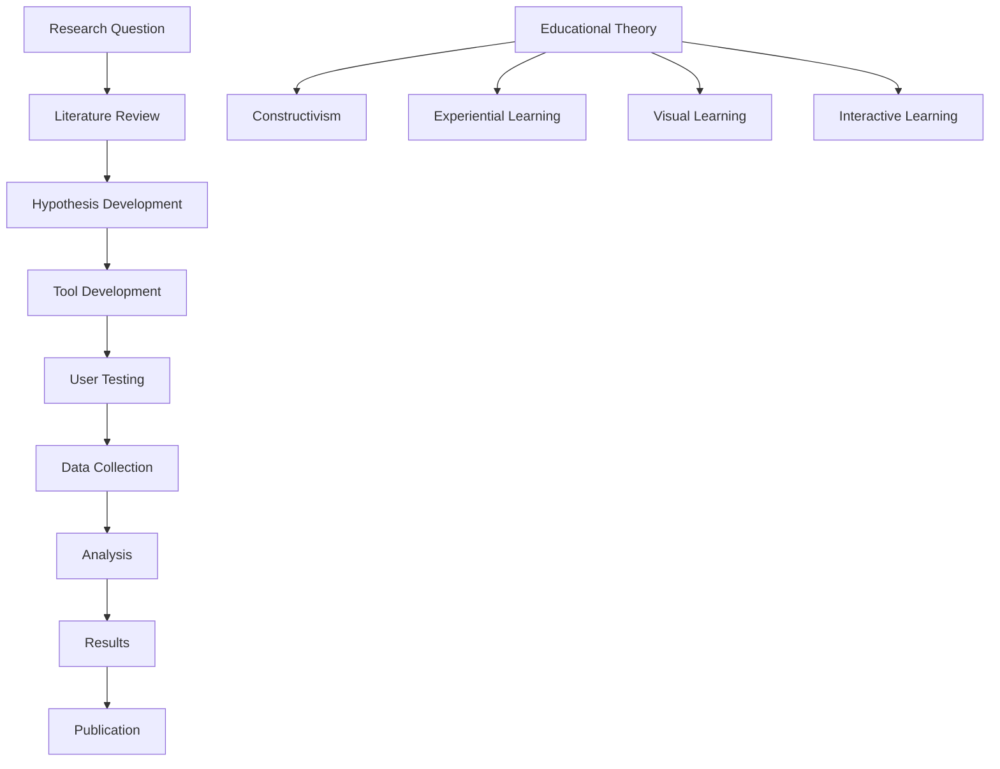

# Project Overview
## Queue Factor Visualizer - College Research Project

---

## 🎓 PROJECT SUMMARY

The **Queue Factor Visualizer** is a sophisticated educational research project developed as part of a comprehensive college initiative to advance machine learning education through interactive visualization. This project represents a significant contribution to educational technology, specifically designed to make complex neural network concepts accessible to students through hands-on simulation.

---

## 🎯 PROJECT MISSION

### Primary Objectives

1. **Educational Excellence**: Create an interactive learning platform that makes neural network task scheduling concepts accessible to students
2. **Research Contribution**: Advance the field of educational technology through innovative visualization techniques
3. **Student Engagement**: Provide an engaging, hands-on learning experience that improves comprehension and retention
4. **Academic Integration**: Seamlessly integrate with existing computer science and machine learning curricula
5. **Knowledge Transfer**: Bridge the gap between theoretical concepts and practical understanding

### Research Goals

- **Learning Effectiveness**: Measure and improve learning outcomes through interactive visualization
- **Educational Technology**: Contribute to the advancement of educational technology tools
- **Student Engagement**: Enhance student engagement with complex technical concepts
- **Curriculum Integration**: Develop tools that support existing educational frameworks
- **Accessibility**: Ensure inclusive learning experiences for all students

---

## 🏫 INSTITUTIONAL CONTEXT

### College Research Program

This project is part of a larger college research initiative focused on:

- **Educational Technology Innovation**: Developing cutting-edge educational tools
- **Machine Learning Education**: Advancing ML education through interactive methods
- **Student Learning Enhancement**: Improving learning outcomes through technology
- **Academic Research**: Contributing to educational research literature
- **Industry Collaboration**: Bridging academic and industry needs

### Research Team

- **Lead Developer**: Harsh Jain (B54)
- **Research Advisors**: Faculty and Academic Supervisors
- **Development Team**: Student Researchers and Contributors
- **Testing Team**: Student Beta Testers and Focus Groups
- **Academic Support**: College Administration and Faculty

---

## 🔬 RESEARCH METHODOLOGY

### Educational Research Approach

### Research Questions

1. **Learning Effectiveness**: How does interactive visualization improve student understanding of neural network concepts?
2. **Engagement Impact**: What is the effect of hands-on simulation on student engagement and motivation?
3. **Concept Retention**: How does interactive learning affect long-term knowledge retention?
4. **Learning Preferences**: What learning styles are most effectively supported by this approach?
5. **Educational Integration**: How can this tool be effectively integrated into existing curricula?

### Research Methods

- **Quantitative Analysis**: Performance metrics, assessment scores, usage analytics
- **Qualitative Research**: Student feedback, focus groups, interviews
- **Comparative Studies**: Traditional vs. interactive learning approaches
- **Longitudinal Studies**: Long-term learning outcomes and retention
- **Usability Testing**: User experience and interface effectiveness

---

## 🎮 EDUCATIONAL IMPACT

### Learning Outcomes

Students using this tool will achieve:

1. **Conceptual Understanding**: Deep understanding of neural network task scheduling
2. **Practical Skills**: Hands-on experience with scheduling algorithms
3. **Analytical Thinking**: Ability to analyze and optimize system performance
4. **Problem-Solving**: Skills in addressing real-world computational challenges
5. **Technical Competency**: Enhanced programming and system design skills

### Educational Benefits

- **Visual Learning**: Complex concepts made accessible through visualization
- **Interactive Engagement**: Active learning through hands-on experimentation
- **Immediate Feedback**: Real-time understanding of concepts and algorithms
- **Self-Paced Learning**: Individualized learning experience
- **Assessment Integration**: Built-in evaluation and progress tracking

---

## 🛠️ TECHNICAL INNOVATION

### Technological Advancements

1. **Real-Time Simulation**: Advanced simulation engine for real-time task processing
2. **Interactive Visualization**: Dynamic, responsive user interface
3. **Educational Integration**: Seamless integration with educational workflows
4. **Performance Optimization**: Efficient algorithms for smooth educational experience
5. **Accessibility Design**: Inclusive design for diverse learning needs

### Technical Contributions

- **Educational Technology**: Novel approaches to ML education
- **User Interface Design**: Innovative educational interface design
- **Simulation Algorithms**: Advanced task scheduling simulation
- **Performance Metrics**: Educational performance measurement
- **Accessibility**: Inclusive design for educational technology

---

## 📊 RESEARCH IMPACT

### Academic Contributions

1. **Educational Research**: Contribution to educational technology research
2. **Learning Science**: Insights into visual and interactive learning
3. **Computer Science Education**: Advances in CS education methods
4. **Technology Integration**: Best practices for educational technology
5. **Student Success**: Improved learning outcomes and student success

### Publication Opportunities

- **Educational Technology Journals**: Research on interactive learning tools
- **Computer Science Education**: CS education methodology papers
- **Learning Science**: Studies on visual and interactive learning
- **Conference Presentations**: Educational technology conferences
- **Workshop Papers**: Specialized educational technology workshops

---

## 🌍 BROADER IMPACT

### Educational Community

- **Instructor Resources**: Tools for educators teaching ML concepts
- **Curriculum Development**: Support for curriculum design and implementation
- **Student Success**: Enhanced learning outcomes for students
- **Educational Innovation**: Advancement of educational technology
- **Knowledge Dissemination**: Sharing of educational best practices

### Industry Relevance

- **Workforce Development**: Preparation of students for ML careers
- **Industry Skills**: Development of practical ML skills
- **Technology Transfer**: Bridge between academic and industry needs
- **Innovation Support**: Support for educational innovation
- **Talent Development**: Development of skilled ML professionals

---

## 🔮 FUTURE DIRECTIONS

### Research Expansion

1. **Advanced Algorithms**: Implementation of more sophisticated scheduling algorithms
2. **Multi-User Support**: Collaborative learning features
3. **AI Integration**: AI-powered learning assistance and personalization
4. **Mobile Optimization**: Responsive design for various devices
5. **International Collaboration**: Global educational partnerships

### Educational Development

- **Curriculum Integration**: Deeper integration with existing curricula
- **Assessment Enhancement**: Advanced assessment and evaluation tools
- **Learning Analytics**: Comprehensive learning analytics and insights
- **Accessibility Improvements**: Enhanced accessibility features
- **Multilingual Support**: Support for diverse language communities

---

## 📈 SUCCESS METRICS

### Educational Metrics

- **Learning Outcomes**: Improved student performance and understanding
- **Engagement Levels**: Increased student engagement and motivation
- **Retention Rates**: Better knowledge retention and application
- **Assessment Scores**: Higher assessment and evaluation scores
- **Student Satisfaction**: Positive student feedback and satisfaction

### Technical Metrics

- **Performance**: Smooth, responsive user experience
- **Reliability**: Consistent, reliable operation
- **Accessibility**: Inclusive design and accessibility compliance
- **Usability**: Intuitive, user-friendly interface
- **Scalability**: Ability to handle multiple users and scenarios

---

## 🤝 COLLABORATION OPPORTUNITIES

### Academic Partnerships

- **Research Collaborations**: Joint research with other institutions
- **Educational Partnerships**: Collaboration with educational organizations
- **Industry Partnerships**: Partnerships with technology companies
- **International Collaboration**: Global educational partnerships
- **Community Engagement**: Engagement with educational communities

### Knowledge Sharing

- **Open Source Contributions**: Contribution to open source educational tools
- **Best Practices**: Sharing of educational technology best practices
- **Research Publications**: Publication of research findings
- **Conference Presentations**: Presentation at educational conferences
- **Workshop Organization**: Organization of educational workshops

---

## 📚 DOCUMENTATION AND RESOURCES

### Comprehensive Documentation

- **Technical Documentation**: Complete technical specifications and architecture
- **Educational Guides**: Teaching guides and curriculum integration
- **User Manuals**: Comprehensive user documentation
- **Developer Guides**: Development and contribution guidelines
- **Research Papers**: Academic research and publications

### Educational Resources

- **Learning Materials**: Educational content and learning objectives
- **Assessment Tools**: Evaluation and assessment resources
- **Teaching Resources**: Instructor guides and materials
- **Student Resources**: Student learning materials and guides
- **Research Resources**: Research methodology and findings

---

## 🎯 CONCLUSION

The Queue Factor Visualizer represents a significant advancement in educational technology, combining cutting-edge technical innovation with proven educational methodologies. This project demonstrates the power of interactive visualization in making complex concepts accessible and engaging for students.

The project's impact extends beyond the immediate educational benefits to contribute to the broader field of educational technology and learning science. Through rigorous research, innovative design, and comprehensive evaluation, this project sets a new standard for educational technology tools in the field of machine learning education.

The success of this project will be measured not only by its technical achievements but by its ability to enhance student learning, improve educational outcomes, and contribute to the advancement of educational technology as a whole.

---

## 📞 CONTACT INFORMATION

### Project Leadership

- **Lead Developer**: Harsh Jain (B54)
- **Institution**: [College Name]
- **Department**: [Department Name]
- **Email**: [Project Email]
- **Phone**: [Project Phone]

### Research Inquiries

- **Academic Questions**: [Academic Contact]
- **Technical Questions**: [Technical Contact]
- **Collaboration Inquiries**: [Collaboration Contact]
- **Media Inquiries**: [Media Contact]

---

*© 2024 College Research Project. All rights reserved. Confidential and proprietary.*

**Version**: 1.0  
**Effective Date**: [Current Date]  
**Last Updated**: [Current Date]
