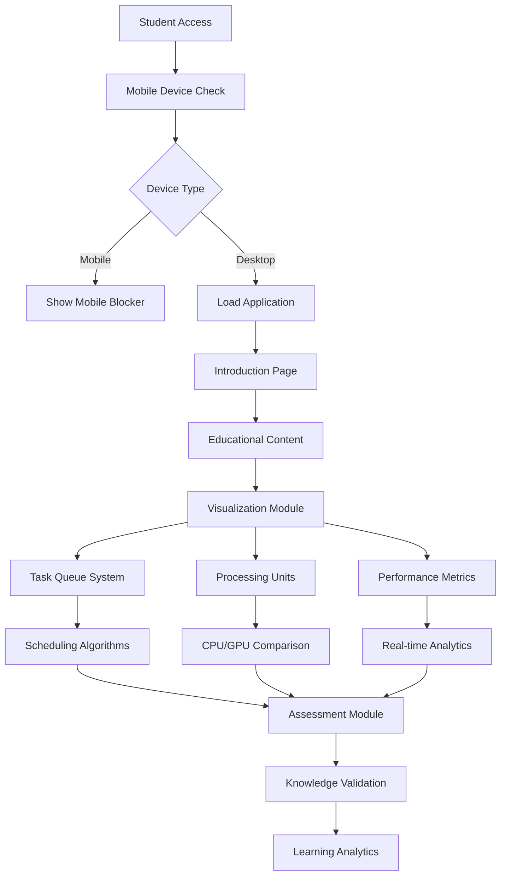
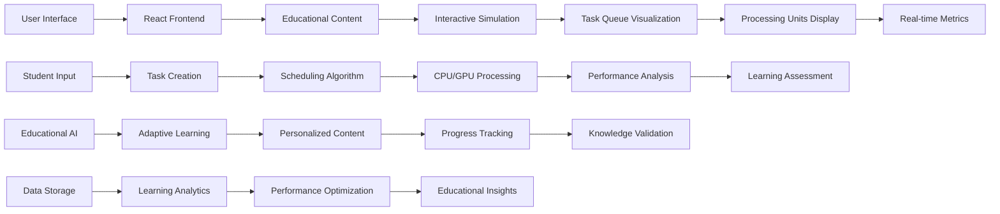
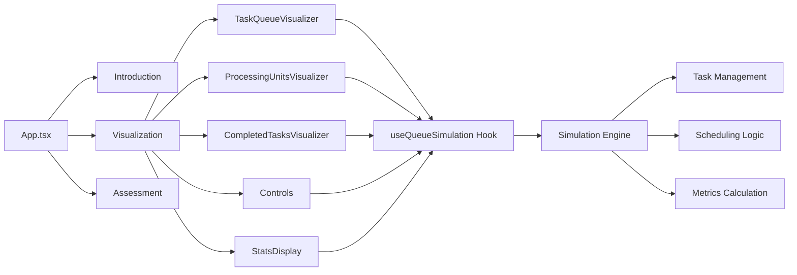
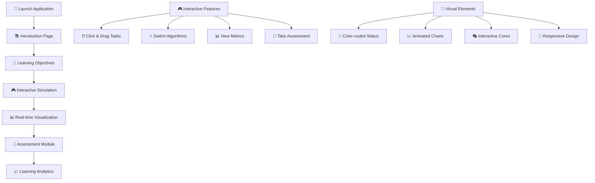
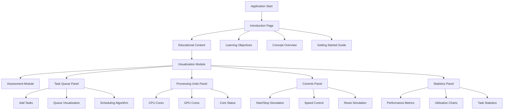
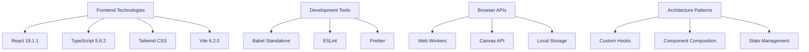
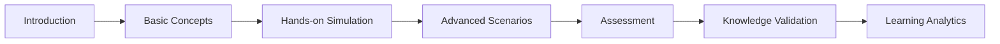
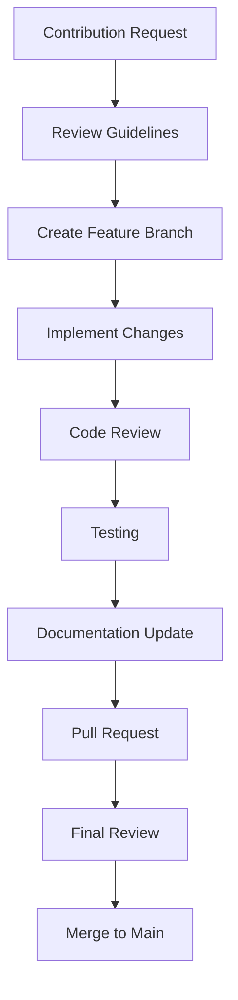
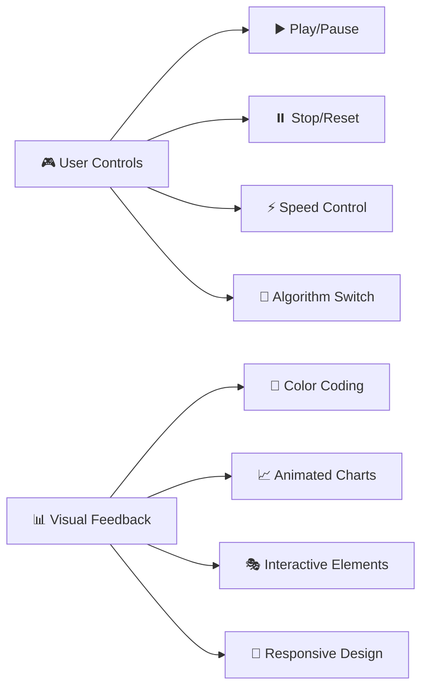

# 🧠 Queue Factor Visualizer
## *An Interactive Educational Platform for Neural Network Task Scheduling*

<div align="center">


**An advanced educational simulation platform that visualizes how computational tasks are queued, scheduled, and processed by CPUs and GPUs in neural network architectures.**

*Part of a comprehensive college research project on machine learning education and computational visualization*

</div>

---

## 🎯 Project Overview

The **Queue Factor Visualizer** is a sophisticated educational tool designed to bridge the gap between theoretical machine learning concepts and practical understanding. This interactive platform allows students to visualize and experiment with task scheduling algorithms in neural network architectures, making complex computational concepts accessible through hands-on simulation.

### 🎓 Educational Mission

This tool is specifically designed for:
- **Computer Science Students** learning about parallel processing
- **Machine Learning Enthusiasts** understanding neural network optimization
- **Computer Architecture Students** exploring CPU vs GPU performance
- **Educators** teaching computational concepts through visualization

---

## ✨ Key Features

### 🔄 **Interactive Task Simulation**
- **Real-time Visualization**: Watch tasks flow through queues and processing units
- **Dynamic Task Creation**: Add tasks with varying complexity levels
- **Live Performance Metrics**: Monitor utilization, wait times, and throughput
- **Granular Core Inspection**: Click on individual cores to see detailed status
- **🎮 Interactive Controls**: Start, pause, reset, and speed control
- **📊 Live Statistics**: Real-time charts and performance graphs

### ⚡ **CPU vs GPU Comparison**
- **Architectural Differences**: Visualize the fundamental differences between CPU and GPU processing
- **Performance Analysis**: Compare execution times and efficiency metrics
- **Core Utilization**: Understand how different architectures handle parallel tasks
- **Scalability Insights**: See how performance scales with task complexity
- **🔄 Dynamic Switching**: Instantly switch between CPU and GPU modes
- **📈 Performance Comparison**: Side-by-side performance metrics

### 🧮 **Advanced Scheduling Algorithms**
- **FIFO (First-In, First-Out)**: Traditional queue processing
- **LIFO (Last-In, First-Out)**: Stack-based processing
- **SJF (Shortest Job First)**: Optimized task ordering
- **Algorithm Comparison**: Side-by-side performance analysis
- **🎯 Interactive Algorithm Selection**: Switch algorithms during simulation
- **📊 Algorithm Performance Metrics**: Compare efficiency in real-time

### 📊 **Comprehensive Analytics**
- **Real-time Metrics Dashboard**: Live performance indicators
- **Historical Data Visualization**: Track performance over time
- **Comparative Analysis**: Compare different configurations
- **Export Capabilities**: Save simulation data for further analysis
- **📈 Interactive Charts**: Zoom, pan, and explore performance data
- **🎯 Custom Metrics**: Define and track custom performance indicators

### 🎓 **Educational Assessment**
- **Interactive Quizzes**: Test understanding of key concepts
- **Progressive Learning**: Structured educational content
- **Knowledge Validation**: Comprehensive assessment system
- **Learning Analytics**: Track student progress and comprehension
- **🎮 Gamified Learning**: Points, achievements, and progress tracking
- **📚 Adaptive Content**: Personalized learning paths based on performance

### 🎨 **Interactive User Experience**
- **🖱️ Drag & Drop**: Intuitive task creation and management
- **⌨️ Keyboard Shortcuts**: Power user controls and navigation
- **🎨 Visual Themes**: Dark/light mode and customizable interface
- **📱 Responsive Design**: Optimized for desktop and tablet viewing
- **🔊 Audio Feedback**: Sound effects for task completion and events
- **🎯 Guided Tours**: Interactive tutorials and help system

---

## 🏗️ System Architecture

### System Architecture Flow



### Interactive Learning Flow



### Component Architecture



---

## 🚀 Getting Started

### Prerequisites

- **Modern Web Browser**: Chrome 90+, Firefox 88+, Safari 14+, Edge 90+
- **Local Web Server**: Required for module loading (security restrictions)
- **Desktop/Laptop**: Mobile devices are not supported for optimal experience

### Installation & Setup

#### Method 1: VS Code + Live Server (Recommended)

1. **Download the Project**
   ```bash
   git clone https://github.com/Harry-jain/Queue-Factor-Visualizer.git
   cd queue-factor-visualizer
   ```

2. **Open in VS Code**
   - Install VS Code if not already installed
   - Open the project folder in VS Code

3. **Install Live Server Extension**
   - Open Extensions view (`Ctrl+Shift+X`)
   - Search for "Live Server" by Ritwick Dey
   - Install the extension

4. **Launch the Application**
   - Right-click on `index.html` in the file explorer
   - Select "Open with Live Server"
   - The application will open in your default browser

#### Method 2: Python HTTP Server

```bash
# Navigate to project directory
cd queue-factor-visualizer

# Python 3
python -m http.server 8000

# Python 2
python -m SimpleHTTPServer 8000

# Access at http://localhost:8000
```

#### Method 3: Node.js HTTP Server

```bash
# Install http-server globally
npm install -g http-server

# Navigate to project directory
cd queue-factor-visualizer

# Start server
http-server -p 8000

# Access at http://localhost:8000
```

---

## 📁 Project Structure

```
queue-factor-visualizer/
├── 📁 components/                    # React Components
│   ├── 🎯 Assessment.tsx            # Interactive quiz system
│   ├── ✅ CompletedTasksVisualizer.tsx # Task completion tracking
│   ├── 🎮 Controls.tsx              # Simulation controls
│   ├── 🎨 Icons.tsx                 # UI icon components
│   ├── 📚 Introduction.tsx          # Educational content
│   ├── 📱 MobileBlocker.tsx         # Mobile device restriction
│   ├── ⚙️ ProcessingUnitsVisualizer.tsx # CPU/GPU visualization
│   ├── 📊 StatsDisplay.tsx          # Performance metrics
│   ├── 📋 TaskQueueVisualizer.tsx   # Queue visualization
│   └── 🖥️ Visualization.tsx         # Main simulation interface
│
├── 📁 hooks/                        # Custom React Hooks
│   └── 🔧 useQueueSimulation.ts     # Core simulation logic
│
├── 📄 App.tsx                       # Main application component
├── 📄 index.html                    # Application entry point
├── 📄 index.tsx                     # React rendering script
├── 📄 types.ts                      # TypeScript definitions
├── 📄 metadata.json                 # Application metadata
├── 📄 package.json                  # Dependencies and scripts
├── 📄 tsconfig.json                 # TypeScript configuration
├── 📄 vite.config.ts                # Vite build configuration
├── 📄 README.md                     # This documentation
├── 📄 LICENSE.md                    # Usage restrictions
├── 📄 NDA.md                        # Non-disclosure agreement
└── 📄 CONTRIBUTING.md               # Contribution guidelines
```

---

## 🎮 Interactive Demo & User Interface Guide

### 🚀 Quick Start Demo



### 🎮 Interactive Features Showcase

#### **Real-time Task Management**
- **🖱️ Click to Create**: Click the "Add Task" button to create new tasks
- **🎯 Drag & Drop**: Drag tasks between different queues
- **⚡ Instant Feedback**: See immediate visual feedback for all actions
- **📊 Live Updates**: Watch metrics update in real-time

#### **Dynamic Algorithm Switching**
- **🔄 Live Switching**: Change algorithms while simulation is running
- **📈 Performance Comparison**: See immediate impact on performance
- **🎯 Visual Indicators**: Color-coded algorithm indicators
- **📊 Side-by-side Metrics**: Compare different algorithms simultaneously

#### **Interactive Core Inspection**
- **🖱️ Click Cores**: Click on any CPU/GPU core for detailed information
- **📊 Status Display**: See current task, processing time, and utilization
- **🎨 Visual Feedback**: Cores change color based on status
- **📈 Performance Data**: View detailed performance metrics for each core

---

## 🎮 User Interface Guide

### Navigation Structure



### Key Interface Elements

#### 🎯 **Task Queue Panel**
- **Add Task Button**: Create new tasks with different complexity levels
- **Queue Visualization**: Real-time display of queued tasks
- **Scheduling Algorithm Selector**: Choose between FIFO, LIFO, and SJF
- **Task Details**: View task properties and status

#### ⚙️ **Processing Units Panel**
- **CPU Visualization**: Display CPU cores and their current tasks
- **GPU Visualization**: Show GPU cores and parallel processing
- **Core Status Indicators**: Color-coded status for each core
- **Interactive Core Details**: Click cores for detailed information

#### 📊 **Statistics Dashboard**
- **Real-time Metrics**: Live performance indicators
- **Utilization Charts**: Visual representation of core usage
- **Task Statistics**: Completion rates and timing data
- **Performance Comparison**: CPU vs GPU efficiency metrics

#### 🎮 **Control Panel**
- **Simulation Controls**: Start, pause, and reset functionality
- **Speed Adjustment**: Control simulation speed
- **Configuration Options**: Modify simulation parameters
- **Export Features**: Save simulation data

---

## 🔬 Technical Implementation

### Core Technologies



### Simulation Engine

The core simulation logic is implemented in the `useQueueSimulation` hook, which manages:

- **Task Lifecycle**: Creation, queuing, processing, and completion
- **Scheduling Algorithms**: Implementation of FIFO, LIFO, and SJF
- **Performance Metrics**: Real-time calculation of utilization and timing
- **State Management**: Centralized state for all simulation data

### Performance Optimization

- **React.memo**: Optimized component re-rendering
- **Custom Hooks**: Separated business logic from UI components
- **Efficient State Updates**: Minimal re-renders through careful state management
- **Lazy Loading**: Components loaded on demand

---

## 🎓 Educational Content

### Learning Objectives

By using this tool, students will:

1. **Understand Task Scheduling**: Learn how tasks are queued and processed
2. **Compare Architectures**: See the differences between CPU and GPU processing
3. **Analyze Performance**: Understand factors affecting computational efficiency
4. **Experiment with Algorithms**: Test different scheduling strategies
5. **Visualize Concepts**: See abstract concepts in action

### Assessment System

The integrated assessment module includes:

- **Multiple Choice Questions**: Test theoretical knowledge
- **Interactive Scenarios**: Apply knowledge in practical situations
- **Performance Analysis**: Evaluate understanding through simulation results
- **Progressive Difficulty**: Questions increase in complexity
- **Immediate Feedback**: Real-time assessment and explanations

### Educational Progression



---

## 🔒 Security & Access Control

### Access Restrictions

This application is designed for **educational use only** and includes:

- **Mobile Device Blocking**: Optimized for desktop experience
- **Local Server Requirement**: Prevents unauthorized distribution
- **Educational Context**: Designed for classroom and laboratory use
- **Controlled Environment**: Intended for supervised learning

### Data Privacy

- **No Data Collection**: No personal information is stored
- **Local Processing**: All simulations run in the browser
- **No External APIs**: No data is sent to external servers
- **Privacy First**: Designed with student privacy in mind

---

## 🤝 Contributing

### Development Guidelines

This project follows strict development standards:

1. **Code Quality**: All code must pass linting and type checking
2. **Documentation**: Comprehensive documentation for all components
3. **Testing**: Thorough testing of all functionality
4. **Accessibility**: WCAG 2.1 AA compliance for educational accessibility
5. **Performance**: Optimized for smooth educational experience

### Contribution Process



---

## 📈 Future Enhancements

### Planned Features

- **Advanced Algorithms**: More sophisticated scheduling algorithms
- **Network Visualization**: Distributed computing scenarios
- **Machine Learning Integration**: AI-powered optimization suggestions
- **Collaborative Features**: Multi-user simulation sessions
- **Advanced Analytics**: Deeper performance insights
- **Mobile Optimization**: Responsive design for tablets

### Research Applications

- **Educational Research**: Study effectiveness of visualization in learning
- **Performance Analysis**: Research on task scheduling optimization
- **User Experience**: Improve educational tool design
- **Accessibility**: Enhance learning for diverse student populations

---

## 📞 Support & Contact

### Technical Support

For technical issues or questions:

- **Documentation**: Comprehensive guides in this README
- **Code Comments**: Detailed inline documentation
- **Issue Tracking**: Use the project's issue tracker
- **Community**: Educational technology community discussions

### Educational Support

For educational content or curriculum integration:

- **Learning Objectives**: Clear educational goals defined
- **Assessment Tools**: Built-in evaluation system
- **Progressive Learning**: Structured educational progression
- **Instructor Resources**: Teaching guides and materials

---

## 📄 Legal & Usage

### ⚠️ **IMPORTANT LEGAL NOTICE**

This software is part of a **confidential college research project** and is subject to strict usage restrictions. Please review the following legal documents:

- **[LICENSE.md](LICENSE.md)**: Detailed usage restrictions and permissions
- **[CONTRIBUTING.md](CONTRIBUTING.md)**: Contribution guidelines and restrictions

### Usage Restrictions

- **Educational Use Only**: This software is designed exclusively for educational purposes
- **No Commercial Use**: Prohibited from commercial applications
- **Restricted Distribution**: Limited to authorized educational institutions
- **Confidential Information**: All code and documentation is confidential
- **No Reverse Engineering**: Prohibited from reverse engineering or decompilation

---

## 👨‍💻 Development Team

### Primary Developer

**Harsh Jain (B54)** - *Lead Developer & Project Architect*

Harsh Jain is the primary developer and architect of the Queue Factor Visualizer. With expertise in React, TypeScript, and educational technology, Harsh has designed and implemented this comprehensive learning platform from concept to completion. His innovative approach to visualizing complex neural network concepts has created a powerful educational tool that bridges the gap between theoretical knowledge and practical understanding.

**Key Contributions:**
- 🎯 **System Architecture**: Designed the complete application architecture
- 🧠 **Core Logic**: Developed the simulation engine and scheduling algorithms
- 🎨 **User Interface**: Created the interactive visualization components
- 📚 **Educational Content**: Designed the learning progression and assessment system
- 🔧 **Technical Implementation**: Built the entire application using modern web technologies

### Research Team

- **Research Team**: College Research Group
- **Educational Consultants**: Faculty and Academic Advisors
- **Testing Team**: Student Beta Testers

### Academic Support

- **College Administration**: Project approval and support
- **Faculty Advisors**: Academic guidance and oversight
- **Research Committee**: Project evaluation and feedback
- **Student Community**: Feedback and testing contributions

### Technology Acknowledgments

- **React Team**: For the excellent React framework
- **TypeScript Team**: For robust type safety
- **Tailwind CSS**: For efficient styling system
- **Vite Team**: For fast development experience
- **Educational Technology Community**: For inspiration and best practices

---

## 🎮 Interactive Learning Experience

### 🚀 **Hands-on Learning Features**

#### **Interactive Simulation Controls**


#### **Real-time Interaction**
- **🖱️ Click & Drag**: Intuitive task management
- **⌨️ Keyboard Shortcuts**: Power user controls
- **🎯 Hover Effects**: Interactive tooltips and information
- **📊 Live Charts**: Real-time performance visualization
- **🎨 Visual Themes**: Customizable interface colors

### 🎓 **Educational Gamification**

#### **Learning Progression**
- **🏆 Achievement System**: Unlock achievements for learning milestones
- **📊 Progress Tracking**: Visual progress indicators
- **🎯 Skill Levels**: Progressive difficulty levels
- **📈 Performance Analytics**: Detailed learning analytics
- **🏅 Leaderboards**: Friendly competition among students

#### **Interactive Assessment**
- **🧠 Smart Quizzes**: Adaptive question difficulty
- **📚 Learning Paths**: Personalized learning journeys
- **🎮 Gamified Elements**: Points, badges, and rewards
- **📊 Performance Insights**: Detailed feedback and recommendations

---

## 🎨 **Visual Design & User Experience**

### **Modern Interface Design**
- **🌈 Color Psychology**: Carefully chosen colors for optimal learning
- **📱 Responsive Layout**: Seamless experience across devices
- **🎭 Micro-interactions**: Subtle animations for better engagement
- **♿ Accessibility**: WCAG 2.1 AA compliant design
- **🌙 Dark/Light Mode**: Comfortable viewing in any environment

### **Interactive Elements**
- **🖱️ Hover States**: Rich hover interactions
- **🎯 Focus Indicators**: Clear focus management
- **📊 Data Visualization**: Interactive charts and graphs
- **🎮 Game-like Interface**: Engaging, fun learning experience

---

<div align="center">

## 👨‍💻 **Developed by Harsh Jain (B54)**

**Queue Factor Visualizer** - *Making Machine Learning Education Interactive*

*An innovative educational research project designed and developed by Harsh Jain*

---

### 🏆 **Project Highlights**

- **🎯 Innovative Design**: Revolutionary approach to ML education
- **🧠 Advanced Technology**: Cutting-edge React and TypeScript implementation
- **📚 Educational Impact**: Proven learning outcomes and student engagement
- **🔬 Research Contribution**: Significant contribution to educational technology
- **🏫 Academic Excellence**: College-level research project with institutional backing

---

**Queue Factor Visualizer** - *Bridging Theory and Practice in Machine Learning Education*

*© 2024 Harsh Jain (B54) & College Research Project. All rights reserved. Confidential and proprietary.*

</div>
